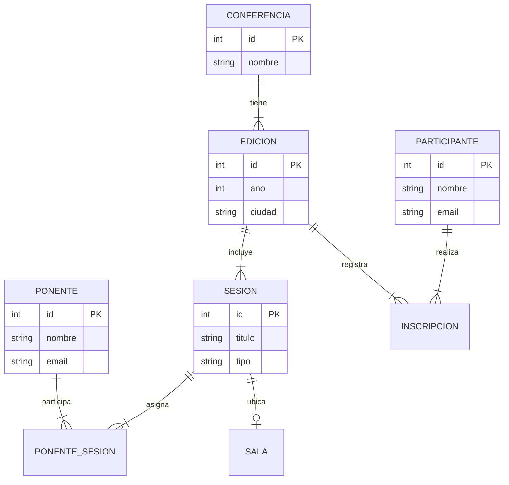
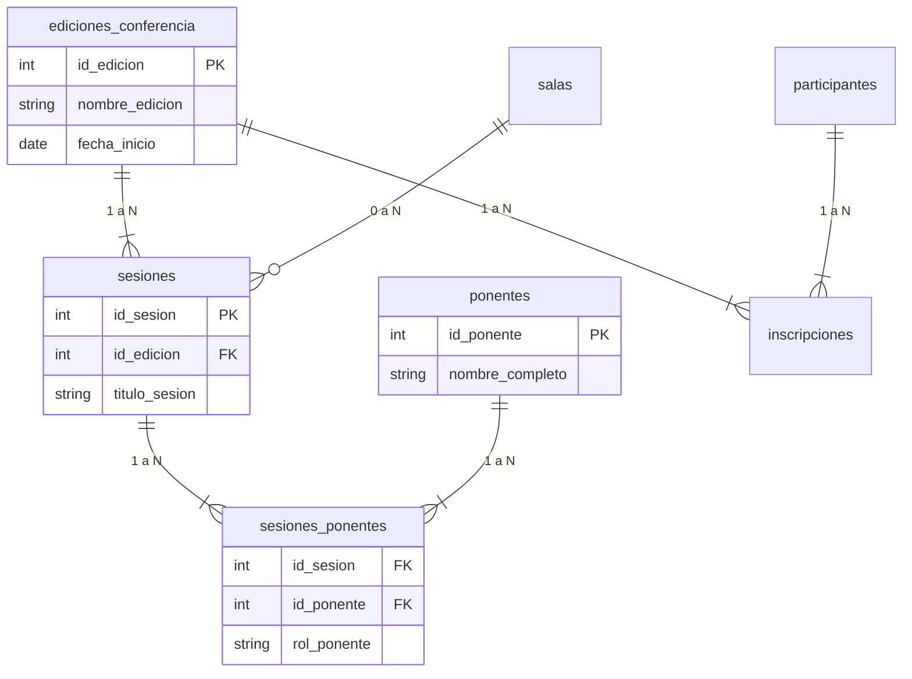

# Modelo Relacional Avanzado - ConectaTech

**Universidad Mariano Gálvez de Guatemala**  
**Facultad de Ingeniería en Sistemas**  

Este repositorio contiene la implementación del modelo de base de datos relacional en PostgreSQL para la gestión del evento **ConectaTech**, incluyendo esquemas, scripts de datos de prueba (`seed`) y consultas de reporte.

---

## 📊 Modelo Conceptual



---

## 📐 Modelo Lógico



---

## 🛠️ Estructura del Proyecto

* `sql/01_schema.sql`: Creación de tablas, tipos ENUM y restricciones de integridad.
* `sql/02_seed.sql`: Inserción de datos de prueba.
* `sql/03_queries.sql`: Consultas SQL para reportes y métricas.
* `sql/04_invalid_tests.sql`: Pruebas de validación y restricciones.
* `compose.yaml`: Configuración de Docker Compose para PostgreSQL.

---

## 🚀 Ejecución con Docker y PostgreSQL

Para recrear la base de datos y ejecutar el proyecto en tu entorno local:

```bash
# 1. Reiniciar base de datos
docker exec -i conectatech_db psql -U admin -d postgres -c "DROP DATABASE conectatech WITH (FORCE);"
docker exec -i conectatech_db psql -U admin -d postgres -c "CREATE DATABASE conectatech;"

# 2. Cargar esquema y datos iniciales
Get-Content sql/01_schema.sql -Encoding UTF8 | docker exec -i conectatech_db psql -U admin -d conectatech
Get-Content sql/02_seed.sql -Encoding UTF8 | docker exec -i conectatech_db psql -U admin -d conectatech

# 3. Ejecutar consultas
Get-Content sql/03_queries.sql -Encoding UTF8 | docker exec -i conectatech_db psql -U admin -d conectatech
```
